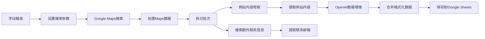

# n8n Google Maps Business Leads Scraper

🚀 **自动化商业潜在客户抓取工作流**

这是一个强大的n8n工作流，用于从Google Maps自动抓取商业潜在客户信息，并结合OpenAI进行数据增强，最终保存到Google Sheets中。

## 📋 目录

- [功能特性](#功能特性)
- [工作流架构](#工作流架构)
- [安装配置](#安装配置)
- [使用方法](#使用方法)
- [输出数据格式](#输出数据格式)
- [自定义配置](#自定义配置)
- [注意事项](#注意事项)

## ✨ 功能特性

### 🎯 核心功能
- **自动化数据抓取**: 从Google Maps自动提取商业信息
- **AI增强处理**: 使用OpenAI分析网站内容，提取额外的商业信息
- **多渠道数据源**: 结合Google Maps、网站爬取和Google搜索
- **智能数据合并**: 自动合并和标准化来自不同源的数据
- **实时保存**: 直接保存到Google Sheets，便于分析和管理

### 📊 提取的数据字段
- **基础信息**: 商业名称、地址、电话、网站
- **评价数据**: 评分、评论数量
- **地理信息**: GPS坐标、营业时间
- **AI增强数据**: 邮箱、联系人、业务描述、服务类型
- **分析数据**: 目标受众、公司规模、社交媒体

## 🏗️ 工作流架构



### 🔧 核心节点说明

1. **手动触发器**: 启动工作流执行
2. **设置搜索参数**: 配置搜索查询、位置、语言等参数
3. **Google Maps搜索**: 使用SerpAPI进行Google Maps数据抓取
4. **处理Maps数据**: 解析和标准化Google Maps返回的数据
5. **拆分批次**: 将数据分批处理，提高效率
6. **网站内容爬取**: 访问商业网站获取详细信息
7. **提取网站内容**: 清理HTML，提取纯文本内容
8. **OpenAI数据增强**: 使用AI分析内容，提取商业洞察
9. **合并格式化数据**: 整合所有数据源的信息
10. **保存到Google Sheets**: 最终数据存储

## ⚙️ 安装配置

### 前置要求

1. **n8n平台**: 本地安装或云版本
2. **API密钥**:
   - SerpAPI密钥 (用于Google Maps搜索)
   - OpenAI API密钥 (用于AI数据增强)
   - Google Sheets API凭据

### 📥 导入工作流

1. 下载 `workflow.json` 文件
2. 在n8n中创建新工作流
3. 点击右上角 "..." 菜单
4. 选择 "Import from File"
5. 上传下载的JSON文件

### 🔐 配置凭据

#### SerpAPI设置
1. 注册 [SerpAPI账户](https://serpapi.com/users/sign_up)
2. 获取API密钥
3. 在n8n中添加SerpAPI凭据

#### OpenAI设置
1. 注册 [OpenAI账户](https://platform.openai.com)
2. 获取API密钥
3. 在n8n中添加OpenAI凭据

#### Google Sheets设置
1. 创建Google Cloud项目
2. 启用Google Sheets API
3. 创建服务账户凭据
4. 在n8n中配置Google Sheets连接

## 🚀 使用方法

### 1. 基础配置

在 "Set Search Parameters" 节点中修改以下参数：

```json
{
  "query": "restaurants in New York",
  "location": "New York, NY, USA", 
  "country_code": "US",
  "language": "en",
  "max_results": 20
}
```

### 2. Google Sheets配置

在 "Save to Google Sheets" 节点中设置：
- `documentId`: 你的Google表格ID
- `sheetName`: 工作表名称（如 "Business Leads"）

### 3. 执行工作流

1. 点击 "Execute Workflow" 按钮
2. 工作流将自动运行所有步骤
3. 查看Google Sheets中的结果

## 📄 输出数据格式

工作流输出包含以下字段的完整商业数据：

| 字段名 | 描述 | 数据源 |
|--------|------|--------|
| `business_name` | 商业名称 | Google Maps |
| `address` | 完整地址 | Google Maps |
| `phone` | 电话号码 | Google Maps |
| `website` | 官方网站 | Google Maps |
| `rating` | 评分 | Google Maps |
| `reviews_count` | 评论数量 | Google Maps |
| `business_type` | 业务类型 | Google Maps |
| `place_id` | Google Place ID | Google Maps |
| `gps_coordinates` | GPS坐标 | Google Maps |
| `hours` | 营业时间 | Google Maps |
| `email` | 邮箱地址 | AI提取 |
| `contact_person` | 联系人 | AI提取 |
| `business_description` | 业务描述 | AI分析 |
| `services` | 服务列表 | AI分析 |
| `target_audience` | 目标受众 | AI分析 |
| `company_size` | 公司规模 | AI分析 |
| `social_media` | 社交媒体 | AI提取 |
| `website_content_preview` | 网站内容预览 | 网站爬取 |
| `scraped_at` | 抓取时间 | 系统生成 |
| `data_source` | 数据来源 | 系统生成 |

## 🎛️ 自定义配置

### 修改搜索参数

```javascript
// 在 "Set Search Parameters" 节点中
{
  "query": "咖啡店 北京",           // 搜索查询
  "location": "Beijing, China",   // 搜索位置
  "country_code": "CN",          // 国家代码
  "language": "zh",              // 语言
  "max_results": 50              // 最大结果数
}
```

### 调整AI提示词

在 "OpenAI Business Data Enhancement" 节点中可以修改系统提示词，以获取特定的数据字段。

### 自定义数据字段

在 "Merge and Format Data" 节点中添加或修改输出字段：

```javascript
const mergedData = {
  // 添加自定义字段
  industry_category: aiData.industry || '',
  establishment_year: aiData.founded || '',
  employee_count: aiData.employees || '',
  // ... 其他字段
};
```

## ⚠️ 注意事项

### 法律合规
- 确保遵守当地的数据抓取法律法规
- 尊重网站的robots.txt文件
- 避免过度频繁的请求

### API使用限制
- **SerpAPI**: 免费版每月100次搜索
- **OpenAI**: 按使用量付费
- **Google Sheets API**: 有请求频率限制

### 性能优化
- 合理设置 `max_results` 参数
- 使用批次处理避免超时
- 监控API使用量和成本

### 数据质量
- AI提取的数据可能不完全准确
- 建议人工验证重要联系信息
- 定期检查数据完整性

## 🔧 故障排除

### 常见问题

**Q: SerpAPI返回空结果**
A: 检查API密钥是否正确，搜索查询是否有效

**Q: OpenAI节点失败**
A: 确认API密钥有效且有足够余额

**Q: Google Sheets保存失败**
A: 检查表格ID和工作表名称是否正确

**Q: 网站爬取超时**
A: 调整HTTP请求的超时设置

## 📈 扩展功能

### 可能的增强
- 添加数据去重逻辑
- 集成CRM系统
- 添加邮件发送功能
- 创建数据分析仪表板
- 添加定时执行触发器

## 📞 支持

如有问题或建议，请：
1. 查看n8n官方文档
2. 检查工作流节点配置
3. 确认API密钥和权限
4. 提交Issue到本仓库

## 📄 许可证

本项目基于MIT许可证开源。

---

**⭐ 如果这个工作流对你有帮助，请给项目点个Star！**

📝 *最后更新: 2025年5月23日*